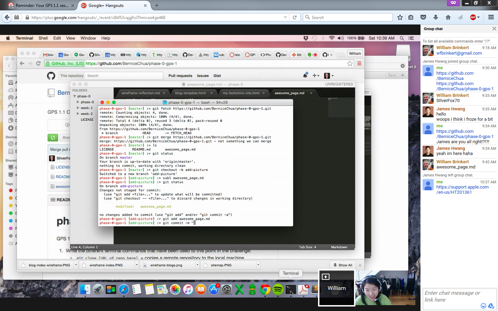

# Showing off our markdown skills.
*Italics*
**Bold**
##blah
`git clone [URL of the repository you want to copy]`
This is [an example](http://www.google.com) of an inline link.

I made a random change for a small merge conflict trollolol~~~!!!
